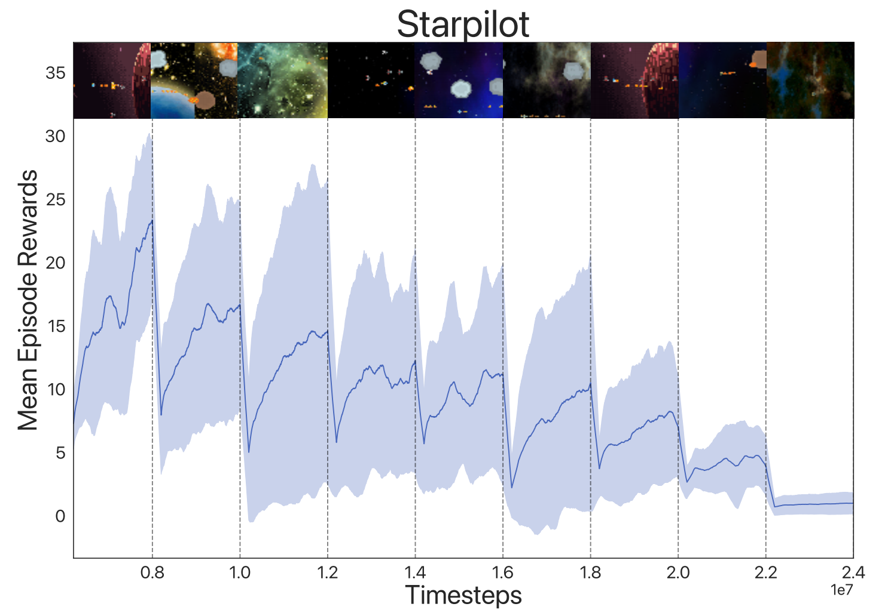
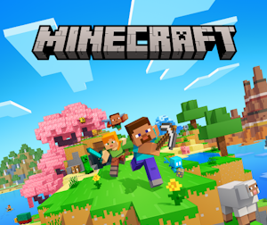
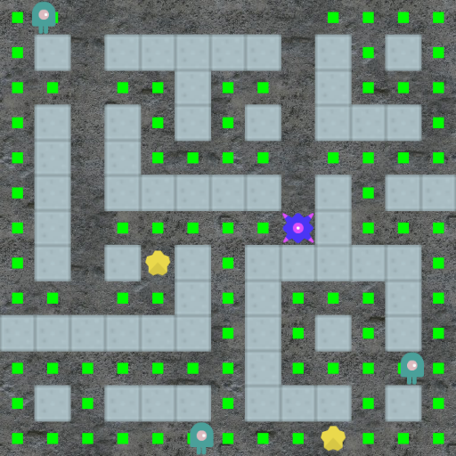

# **News**

    <a href="https://example.com" class="card-link">
        

            

                
            

            

                <h2 class="card-title">[New] Plasticine</h2>
                
Accelerating Research in Plasticity-Motivated Deep Reinforcement Learning.

            

        

    </a>

    <a href="https://example.com" class="card-link">
        

            

                
            

            

                <h2 class="card-title">[ICLR2025 Oral] LS-Imagine</h2>
                
Open-World Reinforcement Learning over Long Short-Term Imagination.

            

        

    </a>

    <a href="https://example.com" class="card-link">
        

            

                
            

            

                <h2 class="card-title">[TMLR] RLeXplore</h2>
                
Accelerating Research in Intrinsically-Motivated Reinforcement Learning.

            

        

    </a>

  <!--  -->
  

  <h1><i>We advance RL. RL advances everything.</i></h1>

